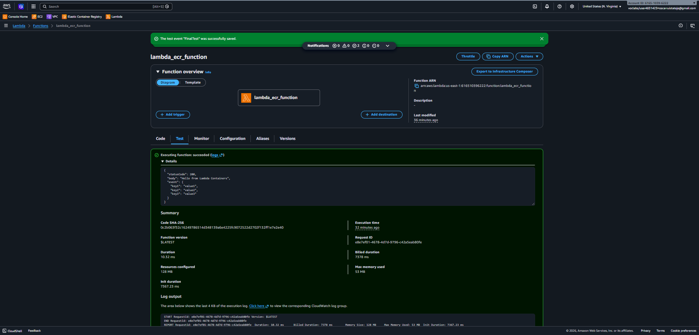

# AWS-Lambda-Docker-project
End-to-end containerized AWS Lambda deployment using Docker and Amazon ECR. Includes troubleshooting for OCI manifest compatibility.
# AWS Serverless Deployment: Docker + Amazon ECR + Lambda

This project demonstrates a complete DevOps workflow for deploying a containerized Python application to **AWS Lambda** using **Amazon ECR** (Elastic Container Registry).

## 🎯 Project Objective
The main goal was to implement a serverless architecture using custom Docker images instead of standard ZIP file deployments. This allows for better dependency management and consistent environments.

## 🛠️ Tech Stack & Services
* **Cloud Platform:** Amazon Web Services (AWS)
* **Compute:** AWS Lambda
* **Container Registry:** Amazon ECR
* **Build Environment:** Amazon EC2 (Ubuntu 22.04)
* **Containerization:** Docker
* **Language:** Python 3.9+

## 🚀 Key Achievements
- **Multi-Architecture Builds:** Configured Docker builds for `x86_64` compatibility.
- **Troubleshooting Expert:** Successfully resolved OCI manifest and provenance issues using advanced Docker flags (`--provenance=false`).
- **Identity & Access Management:** Configured IAM execution roles to allow Lambda to securely pull images from ECR.

## ✅ Results
The function was successfully tested, confirming that the containerized environment correctly handles requests and returns the expected JSON payload.

import json

def handler(event, context):
    return {
        'statusCode': 200,
        'body': json.dumps('Hello from Lambda Containers (Oscar Ruiz Project)!')
    }
